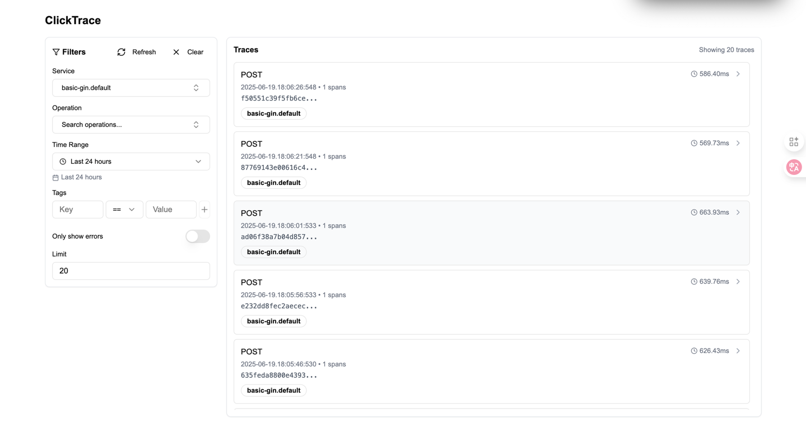
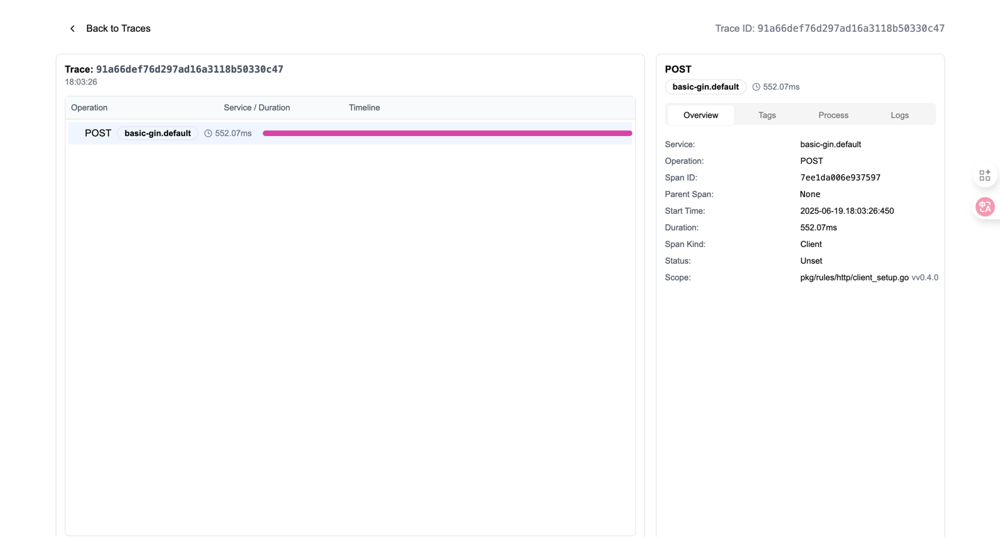

# 🌟 ClickTrace - 分布式跟踪可视化工具
## 🌱 简介
`ClickTrace`是一个分布式跟踪可视化工具，用于分析和可视化分布式系统中的请求和响应。它基于`ClickHouse`数据库之上，提供了实时的分布式跟踪数据查询和可视化功能。
## 🚀 特点
- 高性能查询 ：借助`ClickHouse`的列式存储和向量化查询能力，实现对`Trace`数据的快速检索。
- 可扩展性 ：支持水平扩展，能够轻松应对不断增长的 Trace 数据量。
- 灵活查询 ：提供丰富的查询接口，支持多种查询条件和聚合操作。
- 可视化展示 ：可将查询结果以直观的图表形式展示，方便用户分析。

## 📌 对比 Jaeger
### Jaeger
```
graph TD
    A[Opentelemetry 数据采集器] --> B[Jaeger 控制器] --> C[ClickHouse 存储] <--- D[Jaeger Query 搜索引擎]
 ```
### ClickTrace
```
graph TD
    A[Opentelemetry 数据采集器] --> B[ClickHouse 存储] <--- C[ClickTrace 搜索引擎]
 ```

> 相比`Jaeger`而言, `ClickTrace` 它：
> - 更轻量级、更高效；
> - 不干扰`OTEL`原生`Trace`数据写入；
> - 优秀的可视化界面；
> - ClickTrace 的链路更短, 提高数据稳定性, 避免因 Jaeger 故障导致数据写入失败；
## 🎉 快速开始
```
version: "3"
services:
  clicktrace:
    container_name: clicktrace
    image: cairry/clicktrace:latest
    ports:
      - "8080:3000"
    environment:
      - TZ=Asia/Shanghai
      - CLICKHOUSE_ADDR="clickhouse:19000"
      - CLICKHOUSE_USER=default
      - CLICKHOUSE_PASSWORD=admin.123
      - CLICKHOUSE_DATABASE=default
      - CLICKHOUSE_TABLE=otel_traces
      - CLICKHOUSE_TIMEOUT=10
    restart: always
```
## 💾 项目预览

